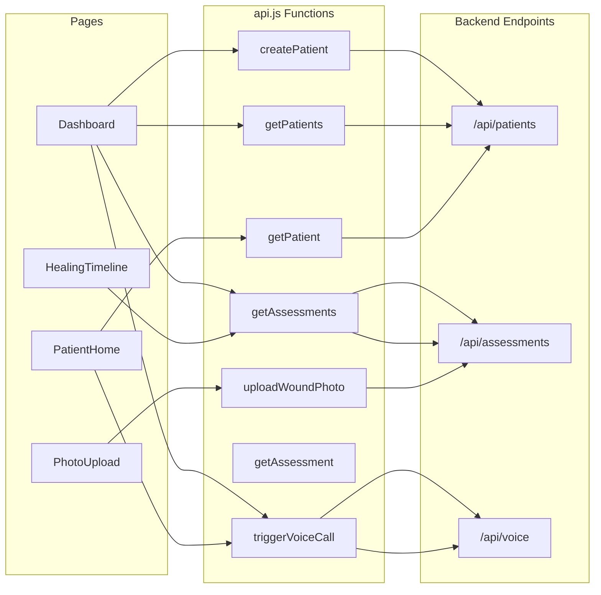

# Frontend Integration Guide

> Everything a frontend developer needs to know to wire up the React app to the backend API. All endpoints, request/response shapes, error handling, and page-by-page implementation guidance.

---

## Quick Start

```bash
cd frontend && npm install && npm run dev   # → http://localhost:5173
cd backend && uvicorn app.main:app --reload # → http://localhost:8000
```

Vite proxies `/api` → `http://localhost:8000` in dev. No CORS issues locally.

The API layer is already set up in `src/services/api.js` — just import and use the functions.

---

## API Base

```js
// src/services/api.js (already exists)
const api = axios.create({
  baseURL: "/api",
  timeout: 30000,
});
```

All endpoints are prefixed with `/api`. Responses are JSON. Errors use standard HTTP codes with `{ "detail": "error message" }`.

---

## Data Flow Overview



---

## Endpoints Reference

### 1. Patients

#### `POST /api/patients` — Create Patient

```js
import { createPatient } from '../services/api';

const { data } = await createPatient({
  name: "Arsh Roy",              // required
  age: 45,                       // required, int
  phone: "9876543210",           // required, used for voice calls
  surgery_type: "Appendectomy",  // required
  surgery_date: "2025-02-15",    // required, ISO date (YYYY-MM-DD)
  gender: "male",                // optional
  wound_location: "Abdomen",     // optional
  risk_factors: ["diabetes", "obesity"],  // optional, string array
  language_preference: "hi-IN",  // optional, default "hi-IN" (used for voice calls)
});

// Response (201):
{
  "patient_id": "a1b2c3d4-...",
  "name": "Arsh Roy",
  "age": 45,
  "phone": "9876543210",
  "surgery_type": "Appendectomy",
  "surgery_date": "2025-02-15",
  "gender": "male",
  "wound_location": "Abdomen",
  "risk_factors": ["diabetes", "obesity"],
  "language_preference": "hi-IN",
  "created_at": "2025-02-15T10:30:00"
}
```

#### `GET /api/patients` — List All Patients

```js
import { getPatients } from "../services/api";

const { data } = await getPatients();
// Response (200): Array of Patient objects
// [{ patient_id, name, age, phone, surgery_type, surgery_date, ... }, ...]
```

#### `GET /api/patients/:id` — Get Single Patient

```js
import { getPatient } from "../services/api";

const { data } = await getPatient("a1b2c3d4-...");
// Response (200): Patient object
// Error (404): { "detail": "Patient not found" }
```

#### `PUT /api/patients/:id` — Update Patient

```js
import { updatePatient } from "../services/api";

// Only include fields you want to update (partial update)
const { data } = await updatePatient("a1b2c3d4-...", {
  phone: "9999999999",
  language_preference: "ta-IN",
});
// Response (200): Updated Patient object
```

---

### 2. Assessments (Wound Analysis)

#### `POST /api/assessments/upload` — Upload Photo & Get AI Assessment

> **This is the core endpoint.** It triggers the entire pipeline: S3 upload → YOLO detection → Bedrock AI analysis.

```js
import { uploadWoundPhoto } from "../services/api";

// file = File object from <input type="file"> or camera capture
const { data } = await uploadWoundPhoto("patient-uuid-here", file);
```

**Request:** `multipart/form-data` with two fields:

- `file` — image file (JPEG/PNG)
- `patient_id` — string UUID

**Response (200):**

```json
{
  "assessment_id": "x1y2z3-...",
  "patient_id": "a1b2c3d4-...",
  "image_url": "https://s3.amazonaws.com/wound-photos/...(presigned URL, expires in 1hr)",

  "yolo_detections": [
    {
      "xmin": 120.5,
      "ymin": 80.3,
      "xmax": 340.1,
      "ymax": 290.7,
      "confidence": 0.92,
      "label": "wound"
    }
  ],

  "healing_score": 7.2,

  "pwat_scores": {
    "size": 1,
    "depth": 2,
    "necrotic_tissue_type": 0,
    "necrotic_tissue_amount": 0,
    "granulation_tissue_type": 3,
    "granulation_tissue_amount": 3,
    "edges": 1,
    "periulcer_skin_viability": 1,
    "total_score": 11
  },

  "infection_status": "none",
  "tissue_types": ["granulation", "epithelialization"],
  "anomalies": [],
  "urgency_level": "low",
  "summary": "Wound is healing well with healthy granulation tissue. Edges are beginning to contract. No signs of infection.",
  "recommendations": [
    "Continue current wound care regimen",
    "Keep area clean and dry",
    "Avoid strenuous physical activity"
  ],
  "voice_agent_script": "Hi Arsh, I've reviewed your wound photo from today. Your healing score is 7.2 out of 10, which is good...",
  "days_post_op": 5,
  "created_at": "2025-02-20T14:30:00"
}
```

**Key fields for UI:**

| Field                | Type                                               | How to use in UI                                                                                                                    |
| -------------------- | -------------------------------------------------- | ----------------------------------------------------------------------------------------------------------------------------------- |
| `healing_score`      | float 0-10                                         | Show as gauge/progress bar. ≥7 = green, 4-7 = yellow, <4 = red                                                                      |
| `pwat_scores`        | object                                             | Break down in a score card. Each sub-score is 0-4 (except `periulcer_skin_viability` 0-2). `total_score` out of 32, lower is better |
| `urgency_level`      | `"low"` / `"medium"` / `"high"`                    | Status badge color. High = red alert, triggers SNS to clinician                                                                     |
| `infection_status`   | `"none"` / `"infection"` / `"ischemia"` / `"both"` | Alert badge if not `"none"`                                                                                                         |
| `tissue_types`       | string[]                                           | Render as tags/chips                                                                                                                |
| `anomalies`          | string[]                                           | Show as warning items if non-empty                                                                                                  |
| `recommendations`    | string[]                                           | Display as care instruction list                                                                                                    |
| `image_url`          | string                                             | Display uploaded photo. **Note: presigned URL expires in 1 hour**                                                                   |
| `voice_agent_script` | string or null                                     | Optional — show as "What the voice agent will say" preview                                                                          |

**Possible errors:**

| Code | Detail                                                                  | Cause                 |
| ---- | ----------------------------------------------------------------------- | --------------------- |
| 400  | `"Failed to read uploaded file"` / `"Uploaded file is empty"`           | Bad or empty file     |
| 404  | `"Patient not found"`                                                   | Invalid patient_id    |
| 502  | `"AI assessment service error"` / `"Failed to upload image to storage"` | AWS service down      |
| 503  | `"Wound detection service unavailable"`                                 | YOLO model not loaded |

#### `GET /api/assessments/:patient_id` — Get All Assessments for a Patient

```js
import { getAssessments } from "../services/api";

const { data } = await getAssessments("a1b2c3d4-...");
// Response (200): Array of AssessmentResult objects, sorted by date (newest first)
```

Use this for the **Healing Timeline** page.

#### `GET /api/assessments/detail/:assessment_id` — Get Single Assessment

```js
import { getAssessment } from "../services/api";

const { data } = await getAssessment("x1y2z3-...");
// Response (200): Single AssessmentResult object
```

#### `DELETE /api/assessments/detail/:assessment_id` — Delete Assessment

```js
import api from "../services/api";

await api.delete(`/assessments/detail/${assessmentId}`);
// Response (204): No content
```

> Note: `deleteAssessment` isn't in `api.js` yet — add it if needed.

---

### 3. Voice Agent

#### `POST /api/voice/call` — Trigger Voice Call to Patient

```js
import { triggerVoiceCall } from "../services/api";

const { data } = await triggerVoiceCall("a1b2c3d4-...");
```

**Response (200):**

```json
{
  "conversation_id": "conv_abc123",
  "patient_id": "a1b2c3d4-...",
  "status": "initiated",
  "message": "Hi Arsh, I've reviewed your wound photo from today..."
}
```

**Status values:**

- `"initiated"` — call is being placed via ElevenLabs
- `"simulated"` — ElevenLabs credentials not configured, no real call made (dev mode)

> Show a toast notification with the status. Display `message` as the script preview.

---

### 4. Health Check

```js
import { healthCheck } from "../services/api";

const { data } = await healthCheck();
// Response: { "status": "ok", "service": "api" }
```

Use on app startup to verify backend connectivity.

---

## Page-by-Page Implementation Guide

### 1. `PatientHome.jsx`

**Purpose:** Landing page for the patient — shows their info, latest score, and quick actions.

**API calls needed:**

- `getPatient(patientId)` — fetch patient details
- `getAssessments(patientId)` — get latest assessment data (first item in the array)

**Data mapping:**

```js
const patient = (await getPatient(patientId)).data;
const assessments = (await getAssessments(patientId)).data;
const latest = assessments[0]; // newest first

// UI data
patient.name           → greeting header
patient.surgery_type   → surgery info card
latest?.days_post_op   → "Day X post-op"
latest?.healing_score  → score gauge/ring
latest?.urgency_level  → urgency badge (low=green, medium=yellow, high=red)
latest?.anomalies      → alerts section (if any)
```

**Quick actions:**

- "Upload Photo" → `<Link to="/upload">`
- "Request Call" → `triggerVoiceCall(patientId)` — show toast with result

**Important:** You need a way to know which `patientId` is the current user. For the hackathon demo, hardcode it or use localStorage / URL param.

---

### 2. `PhotoUpload.jsx`

**Purpose:** Camera/file upload → AI assessment result.

**Implementation flow:**

```
1. User selects/captures photo → show preview
2. User taps "Upload & Analyze" → show loading spinner
3. Call uploadWoundPhoto(patientId, file)
4. Show assessment result card with scores
```

**Key implementation:**

```jsx
const handleFileSelect = (e) => {
  const file = e.target.files[0];
  if (!file) return;
  setSelectedFile(file);
  setPreview(URL.createObjectURL(file));
};

const handleUpload = async () => {
  if (!selectedFile) return;
  setUploading(true);
  try {
    const { data } = await uploadWoundPhoto(patientId, selectedFile);
    setResult(data);
    toast.success(`Healing score: ${data.healing_score}/10`);
  } catch (err) {
    toast.error(err.response?.data?.detail || "Upload failed");
  } finally {
    setUploading(false);
  }
};
```

**Result card should display:**

- `healing_score` — as a circular gauge or large number
- `pwat_scores` — as a breakdown grid (8 sub-scores)
- `tissue_types` — as colored chips
- `infection_status` — alert if not "none"
- `urgency_level` — badge
- `anomalies` — warning list
- `recommendations` — care instruction list
- `summary` — brief text
- `image_url` — the uploaded photo with YOLO bounding box overlay (optional)

**Camera capture tip:**

```html
<input type="file" accept="image/*" capture="environment" />
```

This opens the rear camera on mobile devices.

---

### 3. `HealingTimeline.jsx`

**Purpose:** Visual history showing healing progress across days.

**API call:** `getAssessments(patientId)` — returns all assessments sorted newest-first.

**Data mapping for timeline:**

```js
const assessments = (await getAssessments(patientId)).data;

// Each assessment has:
// .created_at    → date label
// .days_post_op  → "Day X"
// .healing_score → score value
// .summary       → short text
// .tissue_types  → tags
// .urgency_level → status dot color
// .image_url     → thumbnail (presigned, 1hr expiry)
```

**UI suggestions:**

- Vertical timeline with one entry per assessment
- Score trend indicator (compare `assessments[i].healing_score` with `assessments[i+1].healing_score`):
  - Score went up → `<TrendingUp />` green
  - Same → `<Minus />` gray
  - Score went down → `<TrendingDown />` red
- Top summary card showing: first score → current score → improvement %

---

### 4. `Dashboard.jsx` (Clinician View)

**Purpose:** Hospital-wide overview of all patients with risk flags.

**API calls:**

- `getPatients()` — list all patients
- `getAssessments(patientId)` — for each patient, get latest assessment

**Implementation approach:**

```js
// Fetch all patients, then enrichment-fetch their latest scores
const patients = (await getPatients()).data;
const enriched = await Promise.all(
  patients.map(async (p) => {
    try {
      const assessments = (await getAssessments(p.patient_id)).data;
      const latest = assessments[0];
      return {
        ...p,
        latest_score: latest?.healing_score ?? null,
        urgency: latest?.urgency_level ?? "unknown",
        anomalies: latest?.anomalies ?? [],
        days_post_op: latest?.days_post_op ?? null,
      };
    } catch {
      return {
        ...p,
        latest_score: null,
        urgency: "unknown",
        anomalies: [],
        days_post_op: null,
      };
    }
  }),
);

// Sort: high urgency first, then medium, then low
const sorted = enriched.sort((a, b) => {
  const order = { high: 0, medium: 1, low: 2, unknown: 3 };
  return (order[a.urgency] ?? 3) - (order[b.urgency] ?? 3);
});
```

**Summary cards at top:**

- Total patients count
- Urgent count (urgency === "high")
- Monitoring count (urgency === "medium")

**Patient list row:**

- Status dot (red/yellow/green)
- Name, surgery type, days post-op
- Healing score
- "Call" button (only for high urgency) → `triggerVoiceCall(patientId)`

**Search filter:** Filter `enriched` by `name` or `surgery_type` matching `searchTerm`.

---

## Error Handling Pattern

Use this pattern consistently across all pages:

```js
try {
  const { data } = await apiCall();
  // handle success
} catch (err) {
  if (err.response) {
    // Server responded with error
    const msg = err.response.data?.detail || "Something went wrong";
    toast.error(msg);

    if (err.response.status === 404) {
      // Resource not found — show empty state
    }
  } else {
    // Network error / timeout
    toast.error("Network error. Is the backend running?");
  }
}
```

**HTTP status codes to handle:**

| Code    | Meaning          | UI Action                              |
| ------- | ---------------- | -------------------------------------- |
| 200/201 | Success          | Show result                            |
| 204     | Deleted          | Remove from list / navigate back       |
| 400     | Bad input        | Show validation error                  |
| 404     | Not found        | Show empty state or redirect           |
| 502     | AWS service down | Show "Service temporarily unavailable" |
| 503     | YOLO down        | Show "Please try again in a moment"    |

---

## Important Notes

### Image URLs Expire

`image_url` fields are S3 presigned URLs that **expire after 1 hour**. Don't cache them indefinitely. If displaying saved assessments, re-fetch if the URL returns 403.

### Patient ID Management

The current app has no auth. For the hackathon demo you can:

- Hardcode a patient ID
- Store selected patient ID in `localStorage`
- Use URL params like `/patient/:id/timeline`
- Use React context to share across pages after selection on Dashboard

### Multipart Upload

`uploadWoundPhoto` in `api.js` already handles `FormData` correctly. Don't set `Content-Type` yourself — axios sets the multipart boundary automatically when given a `FormData` body.

### Voice Call in Dev Mode

If `ELEVENLABS_API_KEY` is not set in the backend `.env`, the voice call endpoint returns `status: "simulated"` instead of making a real call. The `message` field still contains the full script, so you can display it in the UI for demo purposes.

### Assessment Sorting

`GET /api/assessments/:patient_id` returns assessments **sorted newest-first by `created_at`**. No need to sort client-side.
